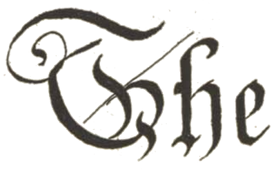

Hiranyakashipu occupying Indra’s throne; Indra and other gods standing before him. Ink on paper ca. 1740–45. Image from the [Brooklyn Museum](https://www.brooklynmuseum.org/opencollection/objects/107660).

In ancient India, if you wanted something and you _really, really_ wanted it, you had an option—pray. You prayed to a specific god, (and you prayed, and you prayed, and you prayed, and… you get the picture), after which the god you prayed to would appear in front of you and grant you a boon. These prayers were never easy and devotees often went to extremes to propitiate their deity of choice.

One example was King Hiraṇyakaśipu. An ambitious man who, according to legend, spent, “long years doing tapasyā (penance) \[and\] after eleven thousand five hundred years of tapasyā, he became like a charred stick, he took severe vows” ¹. The god of creation, Brahmā, pleased with his penance, appeared before Hiraṇyakaśipu and offered him a boon.

Hiraṇyakaśipu said, “I should never die.”  
Brahmā said, “That cannot be granted. Everything ends and everyone dies. Even me.”

---

To First Amendment to the United States Constitution, commonly called the Free Speech Amendment, is simply stated:

> Congress shall make no law respecting an establishment of religion, or prohibiting the free exercise thereof; or abridging the freedom of speech, or of the press; or the right of the people peaceably to assemble, and to petition the Government for a redress of grievances. [_²_](https://www.law.cornell.edu/constitution/first_amendment)

It guarantees, barring a few exceptions and circumstances, that your speech cannot be suppressed by the State. Want to organize a march raising awareness of the upcoming Climate Catastrophe, file a petition and the government _may not_ stop you. Or, if a neo-Nazi group wants to march through a town mostly populated by Holocaust survivors, the government may not stop them no matter. [³](https://www.chicagotribune.com/opinion/commentary/ct-neo-nazi-skokie-march-flashback-perspec-0312-20170310-story.html)

Are there _no_ restrictions? No, _some_ reasonable restrictions may be made. As law professor [Geoffrey R. Stone](https://www.law.uchicago.edu/faculty/stone-g)⁴, succinctly puts it:

> If the law is neutral with respect to content, that is, if it restricts expression without regard to what is being said, then the Court generally balances the state interest against the speech interest to decide whether the restriction is constitutional. Under this approach, a law prohibiting all public speeches in public places is unconstitutional, whereas a law prohibiting the use of loudspeakers after midnight in residential neighborhoods is constitutional. _⁵_

In other words, while the government cannot pass _one_ law prohibiting all Free Speech, it could, potentially, pass _several_ laws each of which only prohibit a Free Speech over a small time window but in aggregate do much harm. This would be death by a thousand cuts.

Let’s now return to Hiraṇyakaśipu and his conversation with Brahmā.

---

Hearing Brahmā’s words, Hiraṇyakaśipu said,

> Hiraṇyakaśipu said, “no god, anti-god, _gandharva_, _yakṣa_, _nāga_, _rākṣasa_, man or _piśāca_ shall defeat me…. No weapons, no hill, no tree, nothing dry, nothing wet… should be the cause of my death…. Not in the sky, not on earth, not at night nor in the morning, neither inside nor out shall I die. Neither beast nor bird shall kill me. O God of gods! If you are pleased with my devotion, grant me this boon.”

> “So be it_,_ Child!” said Brahmā. “I grant your wish.” _¹_

Hiraṇyakaśipu went on to rule the world.

### Footnotes

¹ P. Lal, “_The Mahābhārata of Vyāsa, Book 2, The Complete Sabha Parva_”, ISBN 81-8157-383-8 (2005).

² [https://www.law.cornell.edu/constitution/first\_amendment](https://www.law.cornell.edu/constitution/first_amendment).

³ Ron Grossman, Chicago Tribune, “When the neo-Nazis fought in court to march in Skokie”, Mar 10, 2017 [https://www.chicagotribune.com/opinion/commentary/ct-neo-nazi-skokie-march-flashback-perspec-0312-20170310-story.html](https://www.chicagotribune.com/opinion/commentary/ct-neo-nazi-skokie-march-flashback-perspec-0312-20170310-story.html).

⁴ Geoffrey R. Stone, Edward H. Levi Distinguished Service Professor of Law, University website: [https://www.law.uchicago.edu/faculty/stone-g](https://www.law.uchicago.edu/faculty/stone-g).

⁵ Geoffrey R. Stone, “Privacy, the First Amendment and the Internet,” in _The Offensive Internet: Speech, Privacy, and Reputation_, Martha Nussbaum & Saul Levmore eds. (Harvard University Press, 2010).

#### **About the image**

The image is taken from the Brooklyn Museum’s website. It depicts Hiranyakasipu ascending Indra’s throne. Indra is the king of the Dévās, the gods. [https://www.brooklynmuseum.org/opencollection/objects/107660](https://www.brooklynmuseum.org/opencollection/objects/107660).
